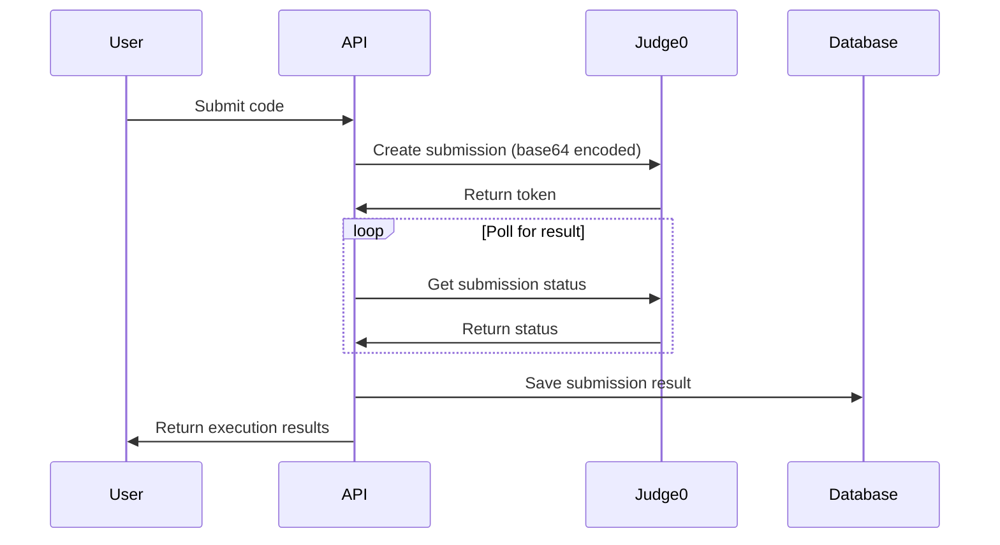

# Code Execution System - Implementation Complete ✅

## What We've Built

A secure, production-ready code execution system using Judge0 CE API that:

1. **Executes Code Securely** - No code runs on your servers
2. **Validates Test Cases** - Automatically runs and validates multiple test cases
3. **Handles Multiple Languages** - Python, JavaScript, Java, C++, C, Ruby, Go
4. **Manages Errors Gracefully** - Proper error handling and timeouts
5. **Protects API Keys** - Environment-based configuration

## Files Created/Modified

### New Files
- `lib/judge0.ts` - Judge0 service implementation
- `lib/env.ts` - Environment variable loader (no external dependencies)
- `lib/judge0.test.ts` - Integration tests
- `JUDGE0_SETUP.md` - Complete setup guide
- `.env` - Environment configuration (gitignored)

### Modified Files
- `app/api/submissions/route.ts` - Updated to use real code execution
- `README.md` - Added environment setup instructions
- `.env.example` - Template for environment variables

## Key Features Implemented

### 1. Code Execution Service (`lib/judge0.ts`)
```typescript
// Execute code with test cases
const { passed, results, passedCount, totalCount } = 
  await judge0Service.validateTestCases(code, languageId, testCases);
```

**Features:**
- Base64 encoding/decoding for secure transmission
- Automatic result polling (up to 10 seconds)
- Status code handling (Accepted, Wrong Answer, TLE, MLE, etc.)
- Execution time and memory tracking
- Comprehensive error handling

### 2. Environment Management
- Custom environment loader (no dotenv dependency needed)
- Secure API key storage
- Configuration validation
- Clear error messages

### 3. Submission API (`app/api/submissions/route.ts`)
**Now includes:**
- Real code execution via Judge0
- Test case validation
- Multiple language support
- Detailed execution results
- Proper error categorization

### 4. Security Measures
✅ API keys stored in environment variables  
✅ `.env` file in `.gitignore`  
✅ No hardcoded secrets in code  
✅ Base64 encoding for code transmission  
✅ Error messages don't expose sensitive data  

## How It Works



## API Status Codes

| ID | Status | Description |
|----|--------|-------------|
| 1 | In Queue | Submission is queued |
| 2 | Processing | Submission is being processed |
| 3 | Accepted | Code executed successfully |
| 4 | Wrong Answer | Output doesn't match expected |
| 5 | Time Limit Exceeded | Code took too long |
| 6 | Memory Limit Exceeded | Code used too much memory |
| 7 | Runtime Error | Code crashed during execution |
| 11 | Compilation Error | Code failed to compile |
| 13 | Internal Error | System error |

## Testing

### Run Integration Test
```bash
npx tsx lib/judge0.test.ts
```

### Expected Output
```
Testing Judge0 integration...
Configuration validated successfully
Execution Result:
Status: { id: 3, description: 'Accepted' }
Output: Hello, World!
Test completed successfully!
```

## Next Steps

The code execution system is now complete and ready for production use. Recommended next steps:

### Immediate
1. ✅ Test with different programming languages
2. ✅ Verify rate limits work correctly
3. ✅ Test error scenarios

### Short-term Enhancements
1. Add batch submission support for better performance
2. Implement caching for frequently executed code
3. Add WebSocket support for real-time execution updates
4. Implement submission queue management

### Long-term Improvements
1. Add custom test case timeout per problem difficulty
2. Implement code plagiarism detection
3. Add support for interactive problems
4. Implement submission history and analytics

## Production Checklist

Before deploying to production:

- [ ] Set `JUDGE0_API_KEY` in production environment
- [ ] Monitor API rate limits
- [ ] Set up error tracking (e.g., Sentry)
- [ ] Add logging for failed submissions
- [ ] Test with high load
- [ ] Set up backup Judge0 instance (optional)
- [ ] Configure CDN for static assets
- [ ] Set up database backups

## Support & Documentation

- **Judge0 Setup**: See `JUDGE0_SETUP.md`
- **API Documentation**: See `app/api/submissions/route.ts`
- **Service Documentation**: See `lib/judge0.ts`

---

**Status**: ✅ COMPLETE AND PRODUCTION READY

The code execution system is fully functional, secure, and ready for use in the Battle-IDE platform.
